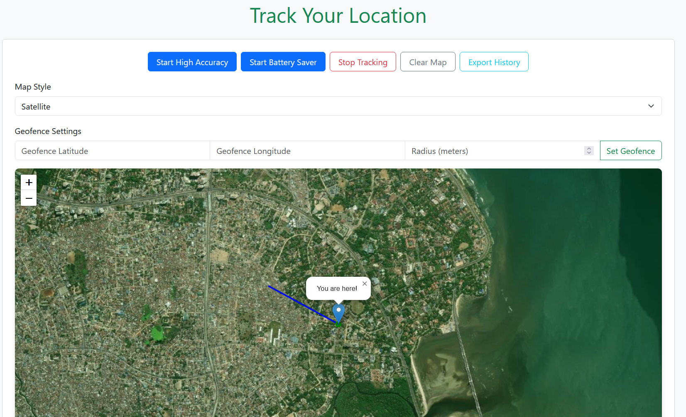

# Find Your Location with Ease 👋📌🗺️

---

# Location Tracker App



A web-based location tracking application built with HTML, JavaScript, Leaflet.js, and Bootstrap. This app allows users to track their real-time location, visualize it on an interactive map, and access advanced features like geofencing, location history, and data export. The app is responsive, supports battery-saving mode, and persists data using localStorage.

## Features

- **Real-Time Location Tracking**:

  - Tracks the user's location using the browser's Geolocation API.
  - Displays the current position with a marker and accuracy circle on an interactive Leaflet map.
  - Updates the map view dynamically as the user moves.

- **Location History**:

  - Stores location data (latitude, longitude, accuracy, and timestamp) in the browser's `localStorage` for persistence across sessions.
  - Displays a scrollable list of past locations with timestamps.

- **Path Visualization**:

  - Draws a polyline on the map to visualize the user's movement path.

- **Geofencing**:

  - Allows users to set a geofence by specifying a center (latitude, longitude) and radius (in meters).
  - Draws a red circle on the map to represent the geofence.
  - Alerts users when they enter or exit the geofence area.

- **Battery-Saving Mode**:

  - Supports two tracking modes:
    - **High Accuracy**: Uses `enableHighAccuracy: true` for precise tracking.
    - **Battery Saver**: Uses `enableHighAccuracy: false` and caches positions for up to 60 seconds to reduce battery usage.

- **Map Style Switching**:

  - Toggle between OpenStreetMap and satellite (Esri World Imagery) map tiles via a dropdown menu.

- **Data Export**:

  - Export location history as a CSV file with columns for latitude, longitude, accuracy, and timestamp.

- **Clear Map**:

  - Resets the map by clearing markers, polylines, accuracy circles, geofences, and location history.

- **Responsive Design**:

  - Optimized for mobile and desktop devices with adjusted map height, font sizes, and button layouts for smaller screens.

- **User-Friendly Interface**:
  - Displays current location details (latitude, longitude, accuracy, timestamp) in the UI.
  - Provides feedback for tracking status and errors (e.g., permission denied, timeout).

## Technologies Used

- **HTML5**: For the app structure.
- **CSS3**: For styling, with Bootstrap 5.3.3 for responsive design.
- **JavaScript**: For core functionality and geolocation handling.
- **Leaflet.js (v1.9.4)**: For interactive map rendering.
- **Bootstrap 5.3.3**: For UI components and responsive layout.
- **Geolocation API**: For accessing the user's location.
- **localStorage**: For persisting location history.

## Prerequisites

- A modern web browser (e.g., Chrome, Firefox, Safari) with geolocation support.
- Internet connection for loading map tiles and external libraries (Bootstrap, Leaflet).
- HTTPS server for deployment, as the Geolocation API requires a secure context.

## Installation

1. **Clone the Repository**:

   ```bash
   git clone https://github.com/Mlindaamani/location-tracker.git
   ```

2. **Navigate to the Project Directory**:

   ```bash
   cd location-tracker
   ```

3. **Open the App**:
   - Open `index.html` in a web browser for local testing (note: geolocation may not work over `file://` due to security restrictions).
   - For full functionality, host the app on an HTTPS server (see Deployment section).

## Usage

1. **Open the App**:

   - Load the app in a browser via an HTTPS URL or local server.

2. **Start Tracking**:

   - Click **Start High Accuracy** for precise tracking or **Start Battery Saver** for lower battery usage.
   - Grant location permissions when prompted.
   - The map will center on your location, showing a marker, accuracy circle, and path.

3. **Stop Tracking**:

   - Click **Stop Tracking** to pause location updates.

4. **Set a Geofence**:

   - Enter latitude, longitude, and radius (in meters) in the geofence input fields.
   - Click **Set Geofence** to draw the geofence on the map.
   - Receive alerts when entering or exiting the geofence.

5. **Change Map Style**:

   - Use the dropdown to switch between OpenStreetMap and satellite views.

6. **View Location History**:

   - Scroll through the location history list to see past coordinates and timestamps.
   - History persists across sessions via `localStorage`.

7. **Export History**:

   - Click **Export History** to download a CSV file of your location data.

8. **Clear Map**:
   - Click **Clear Map** to reset the map and clear all data, including history and geofences.

## Deployment

To deploy the app:

1. **Host on a Static Server**:

   - Use services like GitHub Pages, Netlify, or Vercel to host the static `index.html` file.
   - Ensure the server uses HTTPS, as geolocation requires a secure context.

2. **Example with Netlify**:

   - Drag and drop the project folder into Netlify’s dashboard.
   - Deploy the site and access it via the provided HTTPS URL.

3. **Local Server for Testing**:
   - Use a local server like `http-server` (Node.js) or Python’s `http.server`:
     ```bash
     npx http-server
     ```
     or
     ```bash
     python -m http.server 8000
     ```
   - Access the app at `https://localhost:8000`.

## Limitations

- **Geolocation Accuracy**: Depends on the device’s GPS and network conditions. Battery-saving mode may reduce precision.
- **Local Storage**: Limited by browser storage quotas (typically 5-10MB). For large datasets, consider a backend database.
- **Map Tiles**: Satellite tiles use Esri’s World Imagery; for production, consider Mapbox or Google Maps with an API key.
- **Offline Support**: Not implemented. Add a service worker (e.g., `leaflet.offline`) for offline map tile caching.
- **Geofence Validation**: Basic input validation is included, but additional checks (e.g., latitude/longitude ranges) may be needed.

## Future Enhancements

- Add offline support using service workers and cached map tiles.
- Implement real-time location sharing via WebSockets or a backend service.
- Calculate and display distance traveled and average speed.
- Enhance geofencing with multiple geofences or custom shapes.
- Add user authentication for secure data storage on a backend.

## Contributing

Contributions are welcome! To contribute:

1. Fork the repository.
2. Create a new branch (`git checkout -b feature/your-feature`).
3. Make your changes and commit (`git commit -m "Add your feature"`).
4. Push to the branch (`git push origin feature/your-feature`).
5. Open a pull request.

Please include tests and update documentation for new features.

## License

This project is licensed under the MIT License. See the [LICENSE](LICENSE) file for details.

## Acknowledgments

- [Leaflet.js](https://leafletjs.com/) for the interactive map library.
- [Bootstrap](https://getbootstrap.com/) for responsive UI components.
- [OpenStreetMap](https://www.openstreetmap.org/) and [Esri](https://www.esri.com/) for map tiles.

## Contact

For questions or feedback, open an issue on GitHub or contact [mlindaadolf@gmail.com](mailto:mlindaadolf@gmail.com).

---
